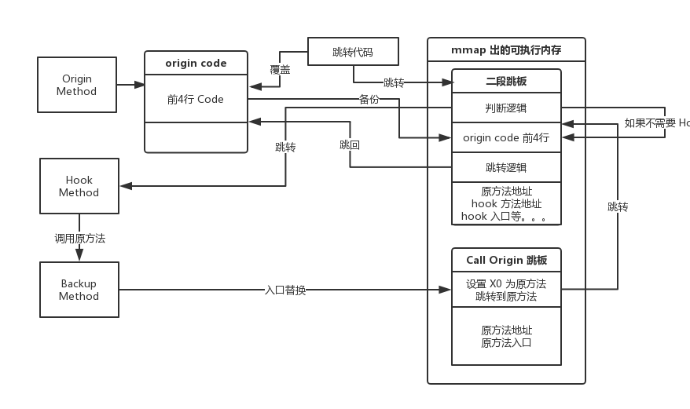
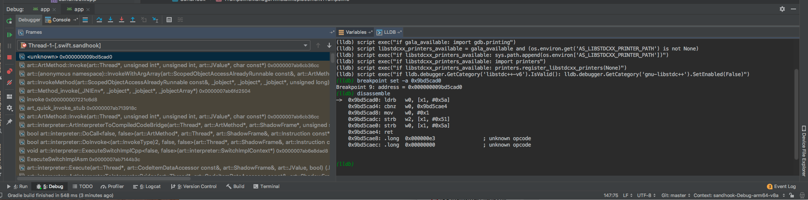
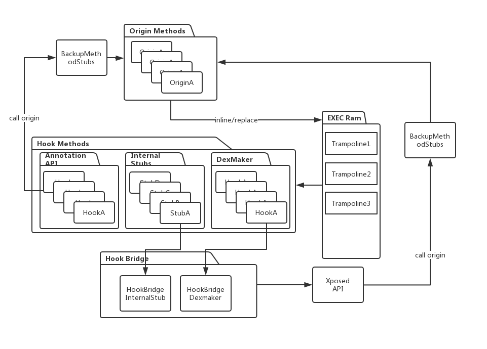

# SandHook

Android Art Hook

Swift Gan

---

## Agenda

- 简介
- ART Invoke 指令生成
- 基本实现
- 指令检查
- Xposed 支持
- inline 处理
- Android Q
- 架构图
- 进程注入

---

## 简介

SandHook 是作用在 Android ART 虚拟机上的 Java 层 Hook 框架，作用于进程内是不需要 Root 的

https://github.com/ganyao114/SandHook

----

### OS
- 4.4(JNI 不支持 call 原方法)
- 5.0 - 5.1
- 6.0
- 7.0 - 7.1
- 8.0 - 8.1
- 9.0
- 10.0

----

### ARCH

- ARM32(基本见不到)
- THUMb32
- AARCH64

----

### 方法范围

- Object Methods
- Static Methods
- Constructors
- System Methods
- JNI Methods
- 不支持 abstract 方法

----

### 如何使用

```gradle
implementation 'com.swift.sandhook:hooklib:3.4.0'
// 不使用 Xposed API 则不需要引入
implementation 'com.swift.sandhook:xposedcompat:3.4.0'
```

- Annotation API
- Xposed API

----

#### Annotation API

```java
@HookClass(Activity.class)
//@HookReflectClass("android.app.Activity")
public class ActivityHooker {

    @HookMethodBackup("onCreate")
    @MethodParams(Bundle.class)
    //@SkipParamCheck //忽略参数匹配，如果 Hooker 里面没有同名 Hook 函数
    static Method onCreateBackup;

    @HookMethodBackup("onPause")
    static HookWrapper.HookEntity onPauseBackup;

    @HookMethod("onCreate")
    public static void onCreate(@ThisObject Activity thiz,
                                @Param("android.os.Bundle") Object bundle) throws Throwable {
        Log.e("ActivityHooker", "hooked onCreate success " + thiz);
        SandHook.callOriginByBackup(onCreateBackup, thiz, bundle);
    }

    @HookMethod("onPause")
    public static void onPause(@ThisObject Activity thiz) throws Throwable {
        Log.e("ActivityHooker", "hooked onPause success " + thiz);
        onPauseBackup.callOrigin(thiz);
    }

}
```

----

#### Xposed API

```java
//setup for xposed
XposedCompat.cacheDir = getCacheDir();
XposedCompat.context = this;
XposedCompat.classLoader = getClassLoader();
XposedCompat.isFirstApplication= true;
//do hook
XposedHelpers.findAndHookMethod(Activity.class, "onResume", new XC_MethodHook() {
      @Override
      protected void beforeHookedMethod(MethodHookParam param) throws Throwable {
          super.beforeHookedMethod(param);
          Log.e("XposedCompat", "beforeHookedMethod: " + param.method.getName());
      }

      @Override
      protected void afterHookedMethod(MethodHookParam param) throws Throwable {
          super.afterHookedMethod(param);
          Log.e("XposedCompat", "afterHookedMethod: " + param.method.getName());
      }
});
```
----
### Edxposed

非官方 Xposed 框架，支持 8.0 - 9.0

https://github.com/ElderDrivers/EdXposed/tree/sandhook

----

### with VA

免 Root Xposed 环境

https://github.com/ganyao114/SandVXposed

---

## ART Invoke 代码生成

- 前言
- ArtMethod
- Quick & Optimizing
- Optimizing
- Sharpening
- 8.0 之前
- 8.0 之后
- 结论

----

### 前言
在正式聊 Hook 方案之前，我们需要先了解一下 ART 对 invoke 字节码的实现，因为这会决定 Hook 的部分实现。
这里的实现理论上分为：解释器实现和编译实现(JIT/AOT)
实际上解释器的实现比较稳定和单一，我们仅仅需要关注编译器实现即可。

----

### ArtMethod
#### Mirror

在了解 ArtMethod 之前先了解一下这个概念：

- Java 对象在内存中的布局可以看成一个结构体，父类的变量在开头，本身的变量紧随其后。
- 这些对象结构体在 ART 中被映射成 mirror::Object cpp 类。
- 有一些虚拟机比较在意的类型，例如 Class，Method 这些 Art 内部所需要的类型，他们在 mirror 中是有对应的类型的
- 成员变量的内存布局也是对应映射的

----

#### ArtMethod

- 在大约 6.0 及之前，java 层中有隐藏类 ArtMethod，Method 与之一对一，而 mirror::ArtMethod 就是 java 层 ArtMethod 的映射。
- 6.0 之后，java ArtMethod 不复存在，Method 与 mirror::ArtMethod 一对一映射，只不过大部分 Field 被 "隐藏" 了。

----

#### GC

- ArtMethod 以及类似的 ArtField 在 Linear 堆区，是不会 Moving GC 的。
- 原因很简单，ArtMethod/ArtField 是有可能 JIT/AOT 在 native code 中的，如果随时变化则不好同步。

----

#### jmethodId -> ArtMethod

```cpp
ALWAYS_INLINE
static inline ArtField* DecodeArtField(jfieldID fid) {
  return reinterpret_cast<ArtField*>(fid);
}

ALWAYS_INLINE
static inline jfieldID EncodeArtField(ArtField* field) {
  return reinterpret_cast<jfieldID>(field);
}

ALWAYS_INLINE
static inline jmethodID EncodeArtMethod(ArtMethod* art_method) {
  return reinterpret_cast<jmethodID>(art_method);
}

ALWAYS_INLINE
static inline ArtMethod* DecodeArtMethod(jmethodID method_id) {
  return reinterpret_cast<ArtMethod*>(method_id);
}
```

可以看到只是简单的 cast，jmethodId 是 ArtMethod 的透明引用。

----

#### ArtMethod 结构

```cpp
  // method 所属类，是 GCRoot，Class 类是可以 Moving GC 的
  // 这点需要特别关注，影响实现
  GcRoot<mirror::Class> declaring_class_;
  // java 层的 Modifier 只有其高 16 位
  // 低 16 位用作 ART 的内部运行，在 java 层被隐藏了
  std::atomic<std::uint32_t> access_flags_;
  // 方法的 CodeItem 在 Dex 中的偏移
  uint32_t dex_code_item_offset_;
  // 方法在 Dex 中的 index
  uint32_t dex_method_index_;
  // 虚方法则为实现方法在 VTable 中的 index
  // 非虚方法则是方法在 DexCodeCache 中的 index
  uint16_t method_index_;
  // 方法的热度，JIT 的重要参考
  uint16_t hotness_count_;

  struct PtrSizedFields {
    // 公共存储区域，用不到
    void* data_;
    // 非常重要！
    // 方法的 Code 入口
    // 如果没有编译，则
    // art_quick_to_interpreter_bridge
    // art_quick_generic_jni_trampoline
    // 如果 JIT/AOT 则为编译后的 native ß入口
    void* entry_point_from_quick_compiled_code_;
  } ptr_sized_fields_;

```

----

#### 方法入口

在 class link 时初步确定

```cpp
//获取该 OAT 方法 Code 的入口地址，表示该方法已编译成机器码
  // Install entry point from interpreter.
  const void* quick_code = method->GetEntryPointFromQuickCompiledCode();
  //获取该 Dex 方法 Code 的入口地址，表示该方法尚未编译，需要解释执行
  bool enter_interpreter = class_linker->ShouldUseInterpreterEntrypoint(method, quick_code);

  if (!method->IsInvokable()) {
    EnsureThrowsInvocationError(class_linker, method);
    return;
  }

  //如果是静态方法，并且不是构造函数，则把代码入口设置成一个桩函数的地址
  //这个函数是通用的，应为所有 static 方法都要在类初始化时候去 resolve。
  //那么先把这个方法设置成一个通用的跳板，当有其他方法调用到的时候，跳板方法将出发该类的初始化
  //在该类初始化的时候，这些跳板方法才会被替换成真正的地址 ClassLinker::InitializeClass -> ClassLinker::FixupStaticTrampolines
  if (method->IsStatic() && !method->IsConstructor()) {
    // For static methods excluding the class initializer, install the trampoline.
    // It will be replaced by the proper entry point by ClassLinker::FixupStaticTrampolines
    // after initializing class (see ClassLinker::InitializeClass method).
    method->SetEntryPointFromQuickCompiledCode(GetQuickResolutionStub());
  }
  //如果是 JNI 方法，设置成通用的 JNI 函数跳板
  else if (quick_code == nullptr && method->IsNative()) {
    method->SetEntryPointFromQuickCompiledCode(GetQuickGenericJniStub());
  }
  //如果方法需要解释执行，则设置成解释执行的跳板
  else if (enter_interpreter) {
    // Set entry point from compiled code if there's no code or in interpreter only mode.
    method->SetEntryPointFromQuickCompiledCode(GetQuickToInterpreterBridge());
  }
```

----

### Quick & Optimizing
ART 中的 Compiler 有两种 Backend：
- Quick
- Optimizing
<br/>
<font size=4>Quick 在 4.4 就引入，直到 6.0 一直作为默认 Compiler, 直到 7.0 被移除。</font>
<br/>
<font size=4>Optimizing 5.0 引入，7.0 - 9.0 作为唯一 Compiler。</font>
<br/>
<font size=4>还有个叫 portable，基本没用过。。。</font>

下面以 Optimizing Compiler 为例分析 ART 方法调用的生成。

----

### Optimizing
Optimizing比Quick生成速度慢，但是会附带各种优化:
- 逃逸分析：如果不能逃逸，则直接栈上分配
- 常量折叠
- 死代码块移除
- 方法内联
- 指令精简
- 指令重排序
- load/store 精简
- Intrinsic 函数替换 。。。

其中包括 Invoke 代码生成：

----

### Sharpening

**invoke-static/invoke-direct 代码生成默认使用 Sharpening 优化**。

----

#### Sharpening 做了两件事情

- 确定加载 ArtMethod 的方式和位置
- 确定直接 blr 入口调用方法还是查询 ArtMethod -> CodeEntry 调用方法

----

#### 结果保存在两个 enum 中

- MethodLoadKind 就是 ArtMethod 加载类型
- CodePtrLocation 就是跳转地址的类型

我们重点关注 CodePtrLocation，但是 CodePtrLocation 在 8.0 有重大变化。

----

### 8.0 之前

```cpp
 // Determines the location of the code pointer.
  enum class CodePtrLocation {
    // 顾名思义，递归调用自己，此时不需要重新加载 ArtMethod
    // 直接跳转到方法开头
    kCallSelf,
    // 直接 B 到偏移地址，多见于调用附近的方法
    kCallPCRelative,
    // 可以直接知道编译完成的入口代码
    // 则可以跳过 ArtMethod->CodeEntry 查询，直接 blx entry
    // 多见于调用系统方法，这些方法中都是绝对地址，不需要重定向
    kCallDirect,
    // link OAT 文件的时候，才能确定方法在内存中的位置
    // 方法入口需要 linker 重定向，也不需要查询 ArtMethod
    kCallDirectWithFixup,
    // 此种需要在 Runtime 期间得知方法入口
    // 需要查询 ArtMethod->CodeEntry
    // 那么由此可见只有在此种情况下，入口替换的 Hook 才有可能生效
    kCallArtMethod,
  };
```

----

### 代码生成

```cpp
void CodeGeneratorARM64::GenerateStaticOrDirectCall(HInvokeStaticOrDirect* invoke, Location temp) {

//处理 ArtMethod 加载
...........

//生成跳转代码
switch (invoke->GetCodePtrLocation()) {
    case HInvokeStaticOrDirect::CodePtrLocation::kCallSelf:
      __ Bl(&frame_entry_label_);
      break;
    case HInvokeStaticOrDirect::CodePtrLocation::kCallPCRelative: {
      relative_call_patches_.emplace_back(invoke->GetTargetMethod());
      vixl::Label* label = &relative_call_patches_.back().label;
      vixl::SingleEmissionCheckScope guard(GetVIXLAssembler());
      __ Bind(label);
      __ bl(0);  // Branch and link to itself. This will be overriden at link time.
      break;
    }
    case HInvokeStaticOrDirect::CodePtrLocation::kCallDirectWithFixup:
    case HInvokeStaticOrDirect::CodePtrLocation::kCallDirect:
      // LR prepared above for better instruction scheduling.
      DCHECK(direct_code_loaded);
      // lr()
      __ Blr(lr);
      break;
    case HInvokeStaticOrDirect::CodePtrLocation::kCallArtMethod:
      // LR = callee_method->entry_point_from_quick_compiled_code_;
      __ Ldr(lr, MemOperand(
          XRegisterFrom(callee_method),
       ArtMethod::EntryPointFromQuickCompiledCodeOffset(kArm64WordSize).Int32Value()));
      // lr()
      __ Blr(lr);
      break;
  }
}
```

----

#### 汇编

- call self

```asm
_functionxxx:
...
...
bl _functionxxx
```

- call direct

```asm
blr lr
```

- call art method

```asm
ldr lr [RegMethod(X0), #CodeEntryOffset]
blr lr
```

----

### 8.0 之后

或许考虑到真正优化的地方在于如何更快的加载 ArtMethod 结构体，所以 8.0 之后编译后的代码都不会再省略：

```asm
ldr lr [RegMethod(X0), #CodeEntryOffset]
```

这一步。

----

#### CodePtrLocation

```cpp
// Determines the location of the code pointer.
  enum class CodePtrLocation {
    kCallSelf,
    kCallArtMethod,
  };
```

----

#### 代码生成

```cpp
switch (invoke->GetCodePtrLocation()) {
    case HInvokeStaticOrDirect::CodePtrLocation::kCallSelf:
      {
        // Use a scope to help guarantee that `RecordPcInfo()` records the correct pc.
        ExactAssemblyScope eas(GetVIXLAssembler(),
                               kInstructionSize,
                               CodeBufferCheckScope::kExactSize);
        __ bl(&frame_entry_label_);
        RecordPcInfo(invoke, invoke->GetDexPc(), slow_path);
      }
      break;
    case HInvokeStaticOrDirect::CodePtrLocation::kCallArtMethod:
      // LR = callee_method->entry_point_from_quick_compiled_code_;
      __ Ldr(lr, MemOperand(
          XRegisterFrom(callee_method),
          ArtMethod::EntryPointFromQuickCompiledCodeOffset(kArm64PointerSize).Int32Value()));
      {
        // Use a scope to help guarantee that `RecordPcInfo()` records the correct pc.
        ExactAssemblyScope eas(GetVIXLAssembler(),
                               kInstructionSize,
                               CodeBufferCheckScope::kExactSize);
        // lr()
        __ blr(lr);
        RecordPcInfo(invoke, invoke->GetDexPc(), slow_path);
      }
      break;
  }
```

----

### invoke-virtual/interface

<font size=5>调用虚方法并不会使用虚方法的 ArtMethod，因为虚方法本身不含 CodeItem，无法执行。那么调用虚方法则需要从 receiver 的类中的 VTable(虚方法表) 中加载真正的实现方法并且调用。
</font>

```cpp
{
    // Ensure that between load and MaybeRecordImplicitNullCheck there are no pools emitted.
    EmissionCheckScope guard(GetVIXLAssembler(), kMaxMacroInstructionSizeInBytes);
    // /* HeapReference<Class> */ temp = receiver->klass_
    __ Ldr(temp.W(), HeapOperandFrom(LocationFrom(receiver), class_offset));
    MaybeRecordImplicitNullCheck(invoke);
  }
  // Instead of simply (possibly) unpoisoning `temp` here, we should
  // emit a read barrier for the previous class reference load.
  // intermediate/temporary reference and because the current
  // concurrent copying collector keeps the from-space memory
  // intact/accessible until the end of the marking phase (the
  // concurrent copying collector may not in the future).
  GetAssembler()->MaybeUnpoisonHeapReference(temp.W());
  // temp = temp->GetMethodAt(method_offset);
  __ Ldr(temp, MemOperand(temp, method_offset));
  // lr = temp->GetEntryPoint();
  __ Ldr(lr, MemOperand(temp, entry_point.SizeValue()));
  {
    // Use a scope to help guarantee that `RecordPcInfo()` records the correct pc.
    ExactAssemblyScope eas(GetVIXLAssembler(), kInstructionSize, CodeBufferCheckScope::kExactSize);
    // lr();
    __ blr(lr);
    RecordPcInfo(invoke, invoke->GetDexPc(), slow_path);
  }
```

----

#### 伪代码

- Class clazz = receiver.getClass()
- Method method = class.getMethodAt(Index);
- ldr lr method->CodeEntry
- blr lr

----

#### 为何不 Hook Abstract

修改 VTable 是否可行？

----

#### SingleImplementation

```cpp
// Set by the class linker for a method that has only one implementation for a
// virtual call.
static constexpr uint32_t kAccSingleImplementation =  0x08000000;  // method (runtime)
```

##### devirtualization

```cpp
ArtMethod* single_impl = interface_method->GetSingleImplementation(pointer_size);
if (single_impl == nullptr) {
   // implementation_method becomes the first implementation for
   // interface_method.
   interface_method->SetSingleImplementation(implementation_method, pointer_size);
   // Keep interface_method's single-implementation status.
   return;
}

ArtMethod {
    // Depending on the method type, the data is
    //   - native method: pointer to the JNI function registered to this method
    //                    or a function to resolve the JNI function,
    //   - conflict method: ImtConflictTable,
    //   - abstract/interface method: the single-implementation if any,
    //   - proxy method: the original interface method or constructor,
    //   - other methods: the profiling data.
    void* data_;
}

```

----

##### 优化步骤

CHA 优化属于内联优化

```cpp
  // Try CHA-based devirtualization to change virtual method calls into
  // direct calls.
  // Returns the actual method that resolved_method can be devirtualized to.
  ArtMethod* TryCHADevirtualization(ArtMethod* resolved_method)
    REQUIRES_SHARED(Locks::mutator_lock_);
```

如果 ART 发现是单实现，则将指令修改为 direct calls

----

```java
  private void test() {
    IDog dog = new DogImpl();
    dog.dosth();
  }
```

----

### InvokeRuntime

一些特殊方法，主要服务于需要在 Runtime 时期才能确定的 Invoke，例如类初始化 <cinit> 函数。(kQuickInitializeType)
InvokeRuntime 会从当前 Thread 中查找 CodeEntry：

----

#### 代码生成

```cpp
void CodeGeneratorARM64::InvokeRuntime(int32_t entry_point_offset,
                                       HInstruction* instruction,
                                       uint32_t dex_pc,
                                       SlowPathCode* slow_path) {
  ValidateInvokeRuntime(instruction, slow_path);
  BlockPoolsScope block_pools(GetVIXLAssembler());
  __ Ldr(lr, MemOperand(tr, entry_point_offset));
  __ Blr(lr);
  RecordPcInfo(instruction, dex_pc, slow_path);
}
```

----

#### 汇编代码

tr 就是线程寄存器，一般 ARM64 是 X19

所以代码出来一般长这样：

```
loc_3e6828:
mov        x0, x19
ldr        x20, [x0, #0x310]
blr        x20
```

----

### Intrinsics 优化

ART 额外维护了一批系统函数的高效实现，这些高效实现利用了CPU的指令，直接跳过了方法调用。

```cpp
  // System.arraycopy.
    case kIntrinsicSystemArrayCopyCharArray:
      return Intrinsics::kSystemArrayCopyChar;

    case kIntrinsicSystemArrayCopy:
      return Intrinsics::kSystemArrayCopy;

    // Thread.currentThread.
    case kIntrinsicCurrentThread:
      return Intrinsics::kThreadCurrentThread;

```

----

#### Thread.currentThread()

```cpp
void IntrinsicCodeGeneratorARM64::VisitThreadCurrentThread(HInvoke* invoke) {
  codegen_->Load(Primitive::kPrimNot, WRegisterFrom(invoke->GetLocations()->Out()),
                 MemOperand(tr, Thread::PeerOffset<8>().Int32Value()));
}
```

最后出来的代码类似这样，直接就把 Thread.nativePeer ldr 给目标寄存器，根本不是方法调用了：

```
ldr x5, [x19, #PeerOffset]
```

----

### 结论

当 8.0 以上时，我们使用 ArtMethod 入口替换即可基本满足 Hook 需求。但如果 8.0 以下，如果不开启 debug 或者 deoptimize 的话，则必须使用 inline hook，否则会漏掉很多调用。

---

## 基本实现

- 确定 ArtMethod 内存布局
- Hooker 项解析
- resolve 静态方法
- resolve cache dex
- 禁用某方法JIT & 手动 JIT 编译
- Hook 线程安全
- 原方法备份
- 选择寄存器
- 开始 hook

----

### ArtMethod 内存布局

由于版本众多，以及 Android 平台的碎片化，Method 的内存布局往往是千变万化的。简单的根据版本写死 Offset 风险还是比较高的。

----

#### ArtMethod 的大小

首先最重要的的一点是确定 ArtMethod 的大小，前面我们知道，ArtMethod 被存放在线性内存区域，并且不会 Moving GC，那么，相邻的两个方法他们的 ArtMethod 也是相邻的，所以 size = ArtMethod2 - ArtMethod1

----

#### 内部元素偏移

- 我们可以在 Java 层反射得到一些值，或者说我们可以根据指定方法的属性确定预测值(accessFlag)，然后我们根据预测值在 ArtMethod 中搜索偏移
- 根据元素在 ArtMethod 中的相对位置确定(code_entry 在最后)

----

### Hooker 项解析

- 首先 Hook 项承载了目标方法的信息，我们根据这些信息找到目标方法。
- 因为被 Hook 的方法会直接调到我们的 Hook 入口，Hook 入口本身也是一个 java 方法，所以参数需要和原方法匹配。

----

### resolve 静态方法

- 静态方法是懒加载的。
- 如果一个类没有被初始化，那么其中的静态方法的入口统一为 art_quick_proxy_invoke_handler
- 第一次调用时，art_quick_proxy_invoke_handler 会走到类初始化流程

----

#### resolve 静态方法

那么很简单，只要手动调用就行了，但是要注意保证调用失败，这里使用不匹配的参数。

```java
    public static void resolveStaticMethod(Member method) {
        //ignore result, just call to trigger resolve
        if (method == null)
            return;
        try {
            if (method instanceof Method && Modifier.isStatic(method.getModifiers())) {
                ((Method) method).setAccessible(true);
                ((Method) method).invoke(new Object(), getFakeArgs((Method) method));
            }
        } catch (Throwable throwable) {
        }
    }

    private static Object[] getFakeArgs(Method method) {
        Class[] pars = method.getParameterTypes();
        if (pars == null || pars.length == 0) {
            return new Object[]{new Object()};
        } else {
            return null;
        }
    }
```

----

### resolve dex cache

为了节省资源并且加快调用速度，和 ELF 的 got.plt 表类似，Caller 去搜索 Callee 的位置时，Callee 带着 index 去 DexCache 中找到对应位置的 Callee 的 ArtMethod 结构体。

但是，DexCache 是懒加载的，我们从 Hook 入口方法调用原方法这一行为 ART 是不知道的，所以无法自动完成这一动作，这里就需要我们手动完成这一操作。

当然后面我们我们也可以使用反射调用原方法来解决这一问题。

----

#### resolve 实现

- 6.0 以其以下 DexCache 相关的字段并没有被 ART 隐藏，所以可以直接通过反射在 Java 层完成
- 6.0 以上则需要在 Native 实现
- 8.1 以上 DexCache 最大为 1024，index 实际为真实 index % 1024 再去取，则有可能在运行期间被覆盖
- 所以 8.1 以后建议通过反射 invoke 调用原方法

----

### 手动 JIT
#### 编译策略

- 6.0 以其以下，默认在安装 apk 过程中会将 Dex 整体 OAT。
- 而 6.0 以上，默认策略是 quick_profile。即根据 profile 文件编译已知的热点方法，则大部分方法都不会被编译
- 则我们如果想使用 inline hook 的话，则必须手动将目标方法编译
- 除此之外，将 hook 入口方法编译可以避免一些意想不到的问题

----

#### 如何编译

- ART 的主体是 libart.so，但是 Compiler 后端被单独编译到了 libart-compiler.so
- 我们只需要 dlsym libart-compiler.so 的导出方法 jit_compile_method 调用即可
- 需要注意 Android N 以上对 dlsym 的限制

----

```cpp
extern "C" void* jit_load(bool* generate_debug_info) {
  VLOG(jit) << "loading jit compiler";
  auto* const jit_compiler = JitCompiler::Create();
  CHECK(jit_compiler != nullptr);
  *generate_debug_info = jit_compiler->GetCompilerOptions()->GetGenerateDebugInfo();
  VLOG(jit) << "Done loading jit compiler";
  return jit_compiler;
}

extern "C" bool jit_compile_method(
    void* handle, ArtMethod* method, Thread* self, bool osr)
    REQUIRES_SHARED(Locks::mutator_lock_) {
  auto* jit_compiler = reinterpret_cast<JitCompiler*>(handle);
  DCHECK(jit_compiler != nullptr);
  return jit_compiler->CompileMethod(self, method, osr);
}
```

----

#### 其他需要注意的

- 手动编译 JNI 方法将发生未知错误
- 在某些系统进程(zygote, system_server)里面，Compiler 是不需要初始化的，所以手动编译将会报错，很好理解，默认这些进程早就被 OAT 了

----

#### 禁用某个方法的 JIT

- 如果我们通过替换入口替换了原方法的 code_entry 来 hook，自然不希望当方法热度高的时候触发 JIT，那么，入口就会被替换掉了，Hook 失效。
- 除此之外，当 backup ArtMethod 被我们魔改后，profile 触发 hook 入口方法的 JIT 时，在编译 invoke backup 方法的字节码，将会遇到错误

```java
ResolveCompilingMethodsClass -> ClassLinker::ResolveMethod -> CheckIncompatibleClassChange -> ThrowIncompatibleClassChangeError
```

----

#### 如何禁用？

ART 的判断逻辑
```cpp
  bool IsCompilable() {
    if (IsIntrinsic()) {
      // kAccCompileDontBother overlaps with kAccIntrinsicBits.
      return true;
    }
    return (GetAccessFlags() & kAccCompileDontBother) == 0;
  }
```

那么加上 kAccCompileDontBother 即可。

---

#### Hook 线程安全

由于在 Hook 时需要修改 ArtMethod 中多个字段，ART 在运行时，众多线程会依赖 ArtMethod，则因此可能导致错误状态。

- 正在 JIT 你修改的方法时
- GC 时，GC 将会搜索栈，栈中有修改的 ArtMethod
- 正好其他线程调到了正在被修改的方法
- 其他线程发生栈回溯(异常)，回溯到了正在修改的 ArtMethod

----

#### StopTheWorld

那么我们需要暂停所有线程，并且等待 GC 完成
幸运的是，ART 等待调试器也需要这一操作，不仅仅是暂停所有线程，还需要等待 GC。
至于是否会影响性能这点不用担心，实测是 nm 级的

```cpp
void Dbg::SuspendVM() {
  // Avoid a deadlock between GC and debugger where GC gets suspended during GC. b/25800335.
  gc::ScopedGCCriticalSection gcs(Thread::Current(),
                                  gc::kGcCauseDebugger,
                                  gc::kCollectorTypeDebugger);
  Runtime::Current()->GetThreadList()->SuspendAllForDebugger();
}
void Dbg::ResumeVM() {
  Runtime::Current()->GetThreadList()->ResumeAllForDebugger();
}
```

----

### 备份原方法

我们需要一个 "容器" 来备份原 ArtMethod。这里有两种方法:

- New 出来
- 写一堆空方法作为 stub

这里我选择写 Stub，因为 New 有致命缺陷

----

#### New 的缺点

- New 出来的 ArtMethod 不在 Linear 区，也就是说这个 "ArtMethod" 会被 Moving GC，那么每次调用原方法的时候，得去跳板中重新设置 ArtMethod 的地址。
- 虽然可以通过 dlsym 使用 ART 内部的函数 "art::LinearAlloc::Alloc" 在 Linear 区分配 "ArtMethod"
- 但是 ArtMethod 中的 declaring_class 是 GCRoot，是回 Moving GC 的，ART 并不知道他的存在，显然 GC 不会帮你更新假 "ArtMethod" 中的 declaring_class。
- 那么还是一样，只要不使用 stub 都需要频繁手动更新地址

----

### 选择寄存器

- 为了不破环栈结构，我们在 hook 时，需要使用纯汇编作为跳板，同时使用尽量少的寄存器完成工作
- 如果通过保存恢复现场来保护寄存器和栈，在 ART 中也是不可行的(或者说仅仅在解释器模式下有希望)
- 因为无论是 GC 还是栈回朔，以及其他的一些 ART 的动态行为，都依赖于栈和一些约定寄存器

----

#### ART 寄存器 的使用

- X0 保存着 Callee 的 ArtMethod
- X1 保存 this
- X2 - X7 保存前 6 个非浮点参数
- D0 - D7 前 8 个浮点参数
- X19 当前 Thread
- X20 GC 标记
- X16/X17 IP0 IP1

最终选择 X17，X16 在跳板中有用到。

---

### 开始 Hook
#### Inline 与否

SandHook 支持两种 Hook "截获" 方案，inline 以及入口替换

- 当 OS >= Android O 时，仅仅需要入口替换
- 当 OS < Android O 时，考虑到大量存在的直接跳转情况，我们选择优先使用 Inline
- 当条件不符合时，例如代码太短，放不下跳板等(后面指令检查细说),只能使用入口替换
- 当然也可以自己选择

----

#### hook 流程

- 首先需要获取 origin/hook/backup(可能没有) 三个 ArtMethod
- 选择 hook 模式
- 备份原方法
- 安装跳板
- 禁止 origin JIT
- 当 OS >= O 并且 debug 模式下，将 origin 设为 native

----

#### 备份原方法

- 整体 mmcopy origin 到 backup 即可
- 如果是 inline，由于原入口已经被塞入跳板，所以我们需要另外一块 call origin 的跳板
- 禁止 backup JIT
- 如果原方法非静态方法，要保证其是 private
- 调用原方法，只需要反射调用 backup 方法即可

----

#### 为何？

```cpp
if (!m->IsStatic()) {
    // Replace calls to String.<init> with equivalent StringFactory call.
    if (declaring_class->IsStringClass() && m->IsConstructor()) {
      m = WellKnownClasses::StringInitToStringFactory(m);
      CHECK(javaReceiver == nullptr);
    } else {
      // Check that the receiver is non-null and an instance of the field's declaring class.
      receiver = soa.Decode<mirror::Object>(javaReceiver);
      if (!VerifyObjectIsClass(receiver, declaring_class)) {
        return nullptr;
      }

      // Find the actual implementation of the virtual method.
      m = receiver->GetClass()->FindVirtualMethodForVirtualOrInterface(m, kRuntimePointerSize);
    }
  }

inline ArtMethod* Class::FindVirtualMethodForVirtualOrInterface(ArtMethod* method,
                                                                PointerSize pointer_size) {
  if (method->IsDirect()) {
    return method;
  }
  if (method->GetDeclaringClass()->IsInterface() && !method->IsCopied()) {
    return FindVirtualMethodForInterface(method, pointer_size);
  }
  return FindVirtualMethodForVirtual(method, pointer_size);
}
```

所以就不会直接调用原方法的 CodeEntry

----

#### 跳板安装
##### 入口替换
入口替换的跳板比较简单，主要就是安装在 origin 的 CodeEntry 上，完成两个任务

- 将 X0 替换成 hook 的 ArtMethod，因为原来是 origin 的 ArtMethod
- 跳转到 hook 的 CodeEntry

----

##### inline
inline 稍显复杂

- 首先一段跳板替换了 origin CodeEntry 的前几行指令，直接跳转到二段跳板
- 将原前几行指令备份到二段跳板中
- 二段跳板首先判断 Callee 是否是需要 Hook 的方法
- 是则设置 X0 跳转到 Hook 入口，不是则跳到备份的指令继续执行原方法

----

#### 跳转图



----

#### 入口相同的情况

- 未编译的 JNI 方法
- 逻辑相同的代码
- 入口相同的方法依然可以重复 inline，因为其组成了责任链模式

----

### 跳板

跳板是一个个模版代码

----

#### 入口替换跳板

```asm
FUNCTION_START(REPLACEMENT_HOOK_TRAMPOLINE)
    ldr RegMethod, addr_art_method
    ldr Reg0, addr_code_entry
    ldr Reg0, [Reg0]
    br Reg0
addr_art_method:
    .long 0
    .long 0
addr_code_entry:
    .long 0
    .long 0
FUNCTION_END(REPLACEMENT_HOOK_TRAMPOLINE)
```

----

#### inline 跳板
##### 一段

```asm
FUNCTION_START(REPLACEMENT_HOOK_TRAMPOLINE)
    ldr RegMethod, addr_art_method
    ldr Reg0, addr_code_entry
    ldr Reg0, [Reg0]
    br Reg0
addr_art_method:
    .long 0
    .long 0
addr_code_entry:
    .long 0
    .long 0
FUNCTION_END(REPLACEMENT_HOOK_TRAMPOLINE)
```

----

##### 二段

```asm
FUNCTION_START(INLINE_HOOK_TRAMPOLINE)
    ldr Reg0, origin_art_method
    cmp RegMethod, Reg0
    bne origin_code
    ldr RegMethod, hook_art_method
    ldr Reg0, addr_hook_code_entry
    ldr Reg0, [Reg0]
    br Reg0
origin_code:
    .long 0
    .long 0
    .long 0
    .long 0
    ldr Reg0, addr_origin_code_entry
    ldr Reg0, [Reg0]
    add Reg0, Reg0, SIZE_JUMP
    br Reg0
origin_art_method:
    .long 0
    .long 0
addr_origin_code_entry:
    .long 0
    .long 0
hook_art_method:
    .long 0
    .long 0
addr_hook_code_entry:
    .long 0
    .long 0
FUNCTION_END(INLINE_HOOK_TRAMPOLINE)
```

----

##### call origin

```asm
FUNCTION_START(CALL_ORIGIN_TRAMPOLINE)
    ldr RegMethod, call_origin_art_method
    ldr Reg0, addr_call_origin_code
    br Reg0
call_origin_art_method:
    .long 0
    .long 0
addr_call_origin_code:
    .long 0
    .long 0
FUNCTION_END(CALL_ORIGIN_TRAMPOLINE)
```

----

### O & debug

- Android O 及以上的 debug 模式会强制走解释器模式
- 当 ART 发现你的方法已经被编译的时候，就不会走 CodeEntry
- ArtInterpreterToInterpreterBridge 直接解释 CodeItem

----

<font size=5>
解释器 Switch -> DoInvoke -> DoCall -> DoCallCommon -> PerformCall
</font>

```cpp
bool ClassLinker::ShouldUseInterpreterEntrypoint(ArtMethod* method, const void* quick_code) {
  if (UNLIKELY(method->IsNative() || method->IsProxyMethod())) {
    return false;
  }

  if (quick_code == nullptr) {
    return true;
  }

  Runtime* runtime = Runtime::Current();
  instrumentation::Instrumentation* instr = runtime->GetInstrumentation();
  if (instr->InterpretOnly()) {
    return true;
  }

  if (runtime->GetClassLinker()->IsQuickToInterpreterBridge(quick_code)) {
    // Doing this check avoids doing compiled/interpreter transitions.
    return true;
  }

  if (Dbg::IsForcedInterpreterNeededForCalling(Thread::Current(), method)) {
    // Force the use of interpreter when it is required by the debugger.
    return true;
  }

  if (Thread::Current()->IsAsyncExceptionPending()) {
    // Force use of interpreter to handle async-exceptions
    return true;
  }

  if (runtime->IsJavaDebuggable()) {
    // For simplicity, we ignore precompiled code and go to the interpreter
    // assuming we don't already have jitted code.
    // We could look at the oat file where `quick_code` is being defined,
    // and check whether it's been compiled debuggable, but we decided to
    // only rely on the JIT for debuggable apps.
    jit::Jit* jit = Runtime::Current()->GetJit();
    return (jit == nullptr) || !jit->GetCodeCache()->ContainsPc(quick_code);
  }

  if (runtime->IsNativeDebuggable()) {
    DCHECK(runtime->UseJitCompilation() && runtime->GetJit()->JitAtFirstUse());
    // If we are doing native debugging, ignore application's AOT code,
    // since we want to JIT it (at first use) with extra stackmaps for native
    // debugging. We keep however all AOT code from the boot image,
    // since the JIT-at-first-use is blocking and would result in non-negligible
    // startup performance impact.
    return !runtime->GetHeap()->IsInBootImageOatFile(quick_code);
  }

  return false;
}

inline void PerformCall(Thread* self,
                        const CodeItemDataAccessor& accessor,
                        ArtMethod* caller_method,
                        const size_t first_dest_reg,
                        ShadowFrame* callee_frame,
                        JValue* result,
                        bool use_interpreter_entrypoint)
    REQUIRES_SHARED(Locks::mutator_lock_) {
  if (LIKELY(Runtime::Current()->IsStarted())) {
    if (use_interpreter_entrypoint) {
      interpreter::ArtInterpreterToInterpreterBridge(self, accessor, callee_frame, result);
    } else {
      interpreter::ArtInterpreterToCompiledCodeBridge(
          self, caller_method, callee_frame, first_dest_reg, result);
    }
  } else {
    interpreter::UnstartedRuntime::Invoke(self, accessor, callee_frame, result, first_dest_reg);
  }
}
```

---

## 指令检查

- Code 长度检查
- Thumb 指令
- 指令对齐
- PC 寄存器相关指令

----

### 指令长度

如果我们需要 inline 一个已经编译的方法，我们就必须知道该方法 Code 的长度能否放下我们的跳转指令，否则就会破坏其他 Code。

----

#### 获取指令长度

某个方法的 Code 在 Code Cache 中的布局为 CodeHeader + Code, 其中 CodeHeader 中存有 Code 的长度。

```cpp
  uint32_t vmap_table_offset_ = 0u;
  uint32_t method_info_offset_ = 0u;
  QuickMethodFrameInfo frame_info_;
  // The code size in bytes. The highest bit is used to signify if the compiled
  // code with the method header has should_deoptimize flag.
  uint32_t code_size_ = 0u;
  // The actual code.
  uint8_t code_[0];
```

----

#### 获取指令长度

<font size=5>
JitCompile->CommitCode->CommitCodeInternal
</font>

```cpp
  size_t alignment = GetInstructionSetAlignment(kRuntimeISA);
  size_t header_size = RoundUp(sizeof(OatQuickMethodHeader), alignment);
  size_t total_size = header_size + code_size;

  OatQuickMethodHeader* method_header = nullptr;
  uint8_t* code_ptr = nullptr;
  uint8_t* memory = nullptr;
  {
    ...
    {
      ....
      code_ptr = memory + header_size;

      std::copy(code, code + code_size, code_ptr);
      method_header = OatQuickMethodHeader::FromCodePointer(code_ptr);
      new (method_header) OatQuickMethodHeader(
          (stack_map != nullptr) ? code_ptr - stack_map : 0u,
          (method_info != nullptr) ? code_ptr - method_info : 0u,
          frame_size_in_bytes,
          core_spill_mask,
          fp_spill_mask,
          code_size);
      FlushInstructionCache(reinterpret_cast<char*>(code_ptr),
                            reinterpret_cast<char*>(code_ptr + code_size));
```

----

#### 获取指令长度

那么可得出 CodeEntry - 4 就是存放 Code Size 的地址

----

### Thumb 指令

- ARM32 模式根据 PC 来区别是 ARM 指令还是 Thumb 指令。  
- 故 inline 的跳板也需要根据这两种模式进行分别实现
- 并且在跳转的时候要注意入口地址符合要求

```cpp
bool isThumbCode(Size codeAddr) {
            return (codeAddr & 0x1) == 0x1;
}
```
----

### 指令对齐

- ART 使用 Thumb2 作为 Thumb 编译实现，Thumb2 指令又分为 Thumb16 和 Thumb32 指令
- 例如 mov 是 16 位指令，ldr 是 32 位指令
- 那么问题来了，我们一级跳板是 4 字节对齐的，原始指令是 2 字节对齐
- 所以在备份原指令的时候一定要注意指令的完整性

----

### PC 寄存器相关指令

先看一个 Java 函数:  

```java
public void setCloseOnTouchOutsideIfNotSet(boolean close) {
  if (!mSetCloseOnTouchOutside) {
        mCloseOnTouchOutside = close;
        mSetCloseOnTouchOutside = true;
    }
}  
```
----

#### 汇编代码



CBNZ 依赖于当前 PC 值。  
虽然这种情况不多，但是检查是必要的，如果我们发现这种指令，直接转用入口替换即可。

---

## Xposed 兼容

- 为何需要兼容
- 可选方案
- 实现
- 性能优化

----

### 为何要兼容 Xposed？

- Xposed 已经拥有众多优秀的开源模块
- Xposed 特殊的(Callback)分发模式可支持多个模块同时 Hook 同一个函数
- 原版 Xposed 需要 Root 并且替换定制 ART，并且 8.0 已经停止更新

----

### 可选方案

我们目前的方案需要手写一个签名与原方法类似的 Hook 方法，而 Xposed API 则使用 Callback，所以我们需要运行期间动态生成方法。

- libffi 动态生成 Native 方法，将 origin 方法注册为 JNI 方法(Frida/Whale),相当于入口替换
- DexMaker 生成 Java 方法，第一次生成较慢，但不存在兼容性
- 或者自己根据调用约定从栈捞参数(epic)，Hook 时较快，但运行时较慢(一次 Hook 调入需要调用很多方法解析参数)，兼容性存疑

----

### DexMaker

最终我选择了 DexMaker

- 需要兼容前面的注解 API
- 性能可接受，使用缓存只需要生成一次
- 只需要完成参数打包的工作，生成的代码及其有限
- 稳定不会有兼容问题
- 运行时是最快的

----

### 性能优化

为了优化第一次生成 Hook 方法的性能缺陷，采取了一种折中的方法，既可以不需要从栈中解析参数，也可以不用动态生成方法。

- 依然是写一堆 Stub，不过这次 Stub 是 Hook 方法
- 为了兼容更多的参数情况(Object 类型以及基本类型(浮点除外))，将所有参数设为 long(32位为 int)，返回值类似
- 这样如果是基本类型参数，则可以简单转换得到值，Object 参数收到的则是内存地址
- 参数多的 stub 可以兼容较少参数的情况

----

写了一个 python 脚本以自动生成
```java
//stub of arg size 3, index 13
    public static long stub_hook_13(long a0, long a1, long a2) throws Throwable {
        return hookBridge(getMethodId(3, 13), null , a0, a1, a2);
    } 
```

----

#### 参数转换

```java
public static Object addressToObject64(Class objectType, long address) {
        if (objectType == null)
            return null;
        if (objectType.isPrimitive()) {
            if (objectType == int.class) {
                return (int)address;
            } else if (objectType == long.class) {
                return address;
            } else if (objectType == short.class) {
                return (short)address;
            } else if (objectType == byte.class) {
                return (byte)address;
            } else if (objectType == char.class) {
                return (char)address;
            } else if (objectType == boolean.class) {
                return address != 0;
            } else {
                throw new RuntimeException("unknown type: " + objectType.toString());
            }
        } else {
            return SandHook.getObject(address);
        }
    }
```

----

#### 对象与地址互转

- 一切的基础在于，当一个对象在栈上时，是不会 Moving GC 的，保证了对象地址在传递中的有效性
- 地址 -> 对象, 使用 ART 内部的 AddWeakGlobalRef
- 对象 -> 地址, 直接使用 Java 层的 Unsafe 类

----

#### 结果

- 如此，几乎 9 成以上的函数 Hook 都走内部 Stub 的方式，Hook 耗时在 1ms 以内
- DexMaker 方式第一次大约需要 80ms 左右，后面直接加载约为 3 - 5ms，其实也能接受

---

## Inline 处理

- ART Inline 优化
- 阻止 JIT Inline
- 阻止 dex2oat Inline(Profile)
- 系统类中 Inline 的如何处理

----

### ART Inline 优化

ART 的 inline 类似其他语言的编译器优化，在 Runtime(JIT) 或者 dex2oat 期间, ART 将 “invoke 字节码指令” 替换成 callee 的方法体。  
往往被 inline 的都是较为简单的方法。  

----

### 阻止 JIT 期间的 Inline

观察 JIT Inline 的条件：  

```cpp

const CompilerOptions& compiler_options = compiler_driver_->GetCompilerOptions();
  if ((compiler_options.GetInlineDepthLimit() == 0)
      || (compiler_options.GetInlineMaxCodeUnits() == 0)) {
    return;
  }

 bool should_inline = (compiler_options.GetInlineDepthLimit() > 0)
      && (compiler_options.GetInlineMaxCodeUnits() > 0);
  if (!should_inline) {
    return;
  }

  size_t inline_max_code_units = compiler_driver_->GetCompilerOptions().GetInlineMaxCodeUnits();
  if (code_item->insns_size_in_code_units_ > inline_max_code_units) {
    VLOG(compiler) << "Method " << PrettyMethod(method)
                   << " is too big to inline: "
                   << code_item->insns_size_in_code_units_
                   << " > "
                   << inline_max_code_units;
    return false;
  }
```
----

当被 inline 方法的 code units 大于设置的阈值的时候，方法 Inline 失败。
这个阈值是 CompilerOptions -> inline_max_code_units_

----

经过搜索，CompilerOptions 一般与 JitCompiler 绑定：

```cpp
class JitCompiler {
 public:
  static JitCompiler* Create();
  virtual ~JitCompiler();

..............
 private:
  std::unique_ptr<CompilerOptions> compiler_options_;

	............
};

}  // namespace jit
}  // namespace art
```

----

ART 的 JitCompiler 为全局单例：

```cpp
  // JIT compiler
  static void* jit_compiler_handle_;

  jit->dump_info_on_shutdown_ = options->DumpJitInfoOnShutdown();
  if (jit_compiler_handle_ == nullptr && !LoadCompiler(error_msg)) {
    return nullptr;
  }

  jit_compiler_handle_ = (jit_load_)(&will_generate_debug_symbols);

extern "C" void* jit_load(bool* generate_debug_info) {
  VLOG(jit) << "loading jit compiler";
  auto* const jit_compiler = JitCompiler::Create();
  CHECK(jit_compiler != nullptr);
  *generate_debug_info = jit_compiler->GetCompilerOptions()->GetGenerateDebugInfo();
  VLOG(jit) << "Done loading jit compiler";
  return jit_compiler;
}
```

----

#### 结论

ok，那么我们就得到了  “static void* jit_compiler_handle_” 的 C++ 符号 “_ZN3art3jit3Jit20jit_compiler_handle_E“

最后修改里面的值就可以了。

SandHook.disableVMInline()

----

### 阻止 dex2oat Inline

- Android N 以上默认的 ART 编译策略为 speed-profile
- 除了 JIT 期间的内联，系统在空闲时会根据这个所谓的 profile 进行 speed 模式的 dex2oat
- speed 模式包含 Inline 优化
- 现象是 App 多打开几次发现 Hook 不到了

----

#### 如何阻止

- 提前主动调用 dex2oat，附带 --inline-max-code-units=0 参数，要求 Dex 是动态加载的 (ArtDexOptimizer)
- 如果上述条件无法满足，则需要干掉 profile 文件以阻止空闲时 dex2oat，当然会对性能造成一定影响 (SandHook.tryDisableProfile)

----

#### profile

- 首先明确一点是 profile 是安装时创建的，并非由 ART 创建，ART 只负责读取以及写入
- profile 存储了方法的热度，以指导 dex2oat 进程编译高热度方法
- 如果你从 Google Play 下载某个热门 App，是有可能带有一份已经有内容的 profile 的
- 综上，我们只需要删除这个文件，如果不保险，则可以修改权限使之不可写

----

#### profile path

<font size=5>
/data/misc/profiles/cur/" + userId + "/" + selfPackageName + "/primary.prof"
</font>

```cpp
bool ProfileCompilationInfo::Load(const std::string& filename, bool clear_if_invalid) {
  ScopedTrace trace(__PRETTY_FUNCTION__);
  std::string error;

  if (!IsEmpty()) {
    return kProfileLoadWouldOverwiteData;
  }

  int flags = O_RDWR | O_NOFOLLOW | O_CLOEXEC;
  ScopedFlock profile_file = LockedFile::Open(filename.c_str(), flags,
                                              /*block*/false, &error);

  if (profile_file.get() == nullptr) {
    LOG(WARNING) << "Couldn't lock the profile file " << filename << ": " << error;
    return false;
  }
```

----

### 系统类中被 Inline 的

- 理论上非 root 的环境是没什么好的办法的
- 只能特例一个个解决
- dexOptimize Caller

----

#### dexOptimize

- 我们 dexOptimize Caller 使 Caller 重返解释执行，那么就可以顺利的调入我们的 Hook 方法
- dexOptimize 其实就是将 ArtMethod 的 CodeEntry 重新设置成解释 bridge
- 依然是上面提到的 art_quick_to_interpreter_bridge/art_quick_generic_jni_trampoline

----

#### 跳板获取

- 这两个跳板不在动态链接表中，(fake)dlsym 无法搜索到
- 但是这个符号是被保留的，在 SHT_SYMTAB 中，这个表存储了所有的符号，所以我重新实现了符号搜索
- 除此之外也可以从未调用的方法中获取，但是可能遇到被强制 dex2oat 的情况

https://github.com/ganyao114/AndroidELF

---

## Android Q

- AccessFlag
- Hidden API

----

### AccessFlag

这个比较好解决，Android Q 上也是因为 Hidden Api 机制为每个方法增加了一个 Flag，导致我使用预测 Flag 值在 ArtMethod 中搜索 Offset 未能搜到。

kAccPublicApi = 0x10000000 代表此方法/Field 为公开 API

----

```cpp
uint32_t accessFlag = getIntFromJava(jniEnv, "com/swift/sandhook/SandHook",
                                                 "testAccessFlag");
            if (accessFlag == 0) {
                accessFlag = 524313;
                //kAccPublicApi
                if (SDK_INT >= ANDROID_Q) {
                    accessFlag |= 0x10000000;
                }
            }
            int offset = findOffset(p, getParentSize(), 2, accessFlag);
```

----

### hidden api

这个是从 Android P 就开始引入的反射限制机制。
目前来说有几种方案：

- Hook 法，Hook 某些判断函数，修改 ART 对限制 API 的判断流程
- Hidden API 在内部抽象为 Policy，修改全局的 Policy 策略，一般是 Runtime 中的某个 Flag
- 系统函数调 Hidden API 是 OK 的，想办法让 ART 误以为是系统函数调用 API，一般是修改 ClassLoader

----

### P 与 Q 的区别

P 上，判断函数较为集中，Policy 的 Flag 也较为好搜索，然而到了 Q 上就多了，至于在 Runtime 中搜索 Flag，由于 Runtime 是个巨大的结构体，这并不是一个健壮的方法。。。

----

### 另外一种解决办法

- 最后是想办法让 ART 误以为是系统函数调用 API，还有一种办法是双重反射，即用反射调用 Class.getDeclareMethod 之类的 API 去使用反射，也能达到目的。(这个方法还是在贴吧偶然看到的，OpenJDK 也有这个问题)
- 后面就简单了，依据此法找到 Hidden API 的开关方法，调用即可。

----

#### 实现

```java
static {
        try {
            getMethodMethod = Class.class.getDeclaredMethod("getDeclaredMethod", String.class, Class[].class);
            forNameMethod = Class.class.getDeclaredMethod("forName", String.class);
            vmRuntimeClass = (Class) forNameMethod.invoke(null, "dalvik.system.VMRuntime");
            addWhiteListMethod = (Method) getMethodMethod.invoke(vmRuntimeClass, "setHiddenApiExemptions", new Class[]{String[].class});
            Method getVMRuntimeMethod = (Method) getMethodMethod.invoke(vmRuntimeClass, "getRuntime", null);
            vmRuntime = getVMRuntimeMethod.invoke(null);
        } catch (Exception e) {
            Log.e("ReflectionUtils", "error get methods", e);
        }
    }

    public static boolean passApiCheck() {
        try {
            addReflectionWhiteList("Landroid/", "Lcom/android/");
            return true;
        } catch (Throwable throwable) {
            throwable.printStackTrace();
            return false;
        }
    }
```

---



---

## 进程注入

到上面为止，Hook 的大部分细节已经介绍完了，但是本进程的 Hook 不是我们想要的。我们想要将 Hook 作用于其他进程则必须将 Hook 逻辑注入到目标进程。

- Root 注入
- 非 Root 注入，沙箱环境
- 非 Root 插件加载
- 代码植入

----

### Root 注入

Root 注入基本分为：

- 全局注入，一般选择注入 Zygote 进程
- 单进程注入，ptrace

----

#### Zygote 注入

- 原版 Xposed 修改了 app_process 的源码，在其中加入加载 Xposed 框架的逻辑
- Edxp 依赖 “Riru”，Riru 伪造了 libmemtrack.so，在其中加入了加载 “模块” 逻辑，libmemtrack 是 Zygote 的必备库，这个库比较简单，所以成为了目标
- 使用 Zygote 的注入，所有 android 进程都将附带 Xposed 的 lib，所以为 “全局注入”

----

#### 单进程注入

- 使用 ptrace，核心在于找到 mmap/dlopen/dlsym 等函数在目标进程的地址
- 依据本进程计算偏移即可
- 要注意 N 以上对 dlopen 的限制
- 问题在于无法绕过目标进程的反调试保护，另外容易错过 Hook 时机
- 另外这种方法也可以注入 Zygote

----

### 非 Root 注入

- 需要沙箱环境，核心在于利用同 UID 免 Root 使用 ptrace，步骤和上面相同
- 类似 GG 助手

https://github.com/ganyao114/SandBoxHookPlugin

----

### 非 Root 插件加载

- 同样需要沙箱环境，不同的是需要沙箱在加载内部 app 进程时主动加载 Xposed 插件
- 这样不会错过 Hook 时机，也不存在反调试问题
- 然而稳定性取决于沙箱本身的稳定性
- 类似 VirtualXposed

https://github.com/ganyao114/SandVXposed

----

### 代码植入

- 解包目标 apk，植入 Xposed 代码，重打包
- 需要 Hook 处理 apk 完整性检查，签名验证
- 处理加壳
- 容易被封号
- 类似太极